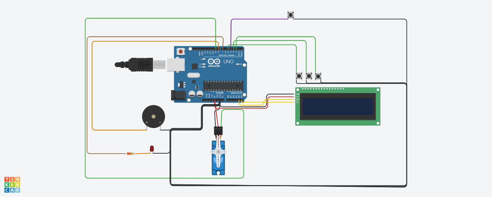
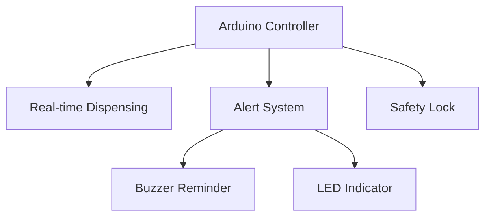

# Smart Pill Dispenser



An Arduino-based smart pill dispenser that automatically dispenses medication at scheduled times and reminds patients to take their pills.

## Features

- Automated pill dispensing at scheduled times
- Visual and audible reminders (LED + buzzer)
- 5-minute window to take medication before automatic retrieval
- Simple one-button interface
- Simulated clock for easy testing (1 second = 1 minute)

## Hardware Requirements

- Arduino Uno
- Servo motor (SG90)
- Piezo buzzer
- LED with resistor
- Push button
- LCD I2C display (16x2)
- Breadboard and jumper wires

## Installation

1. Clone this repository:
   ```bash
   git clone https://github.com/yourusername/smart-pill-dispenser.git


**Smart Pill Dispenser - Never Miss a Dose Again** 💊⏰

A reliable automated medication dispenser that addresses the critical problem of medication non-adherence through intelligent scheduling, reminders, and safety features.

### 🔍 **Motivation**
- **1 in 2 patients** don't take medications as prescribed (WHO)
- **125,000 deaths annually** in US alone from medication non-adherence
- **$300B+ in avoidable costs** due to missed doses
- Elderly and memory-impaired patients need **independent solutions**

### ✨ **Key Innovations**
- **Auto-locking mechanism** prevents double-dosing
- **Time-window enforcement** with pill retrieval
- **Non-intrusive design** (no smartphone dependency)
- **Auditory + visual cues** for accessibility
- **Tinkercad-compatible** for easy prototyping

### 🌟 **Why This Matters**
```diff
+ For Patients: Regain independence with discreet medication management
+ For Caregivers: Reduce stress with automated dose tracking
+ For Healthcare: Lower readmission rates from missed medications
```

### 📌 **Core Features**
| Feature | Benefit |
|---------|---------|
| Scheduled Dispensing | Precise dose timing |
| 5-Minute Retrieval | Prevents pill waste |
| Persistent Alerts | Ensures dose awareness |
| One-Button Operation | Senior-friendly design |

### 🛠 **Technical Implementation**


**Perfect for:**
- Elderly living independently
- Patients with memory conditions
- Post-operative medication schedules
- Clinical trial dose management
